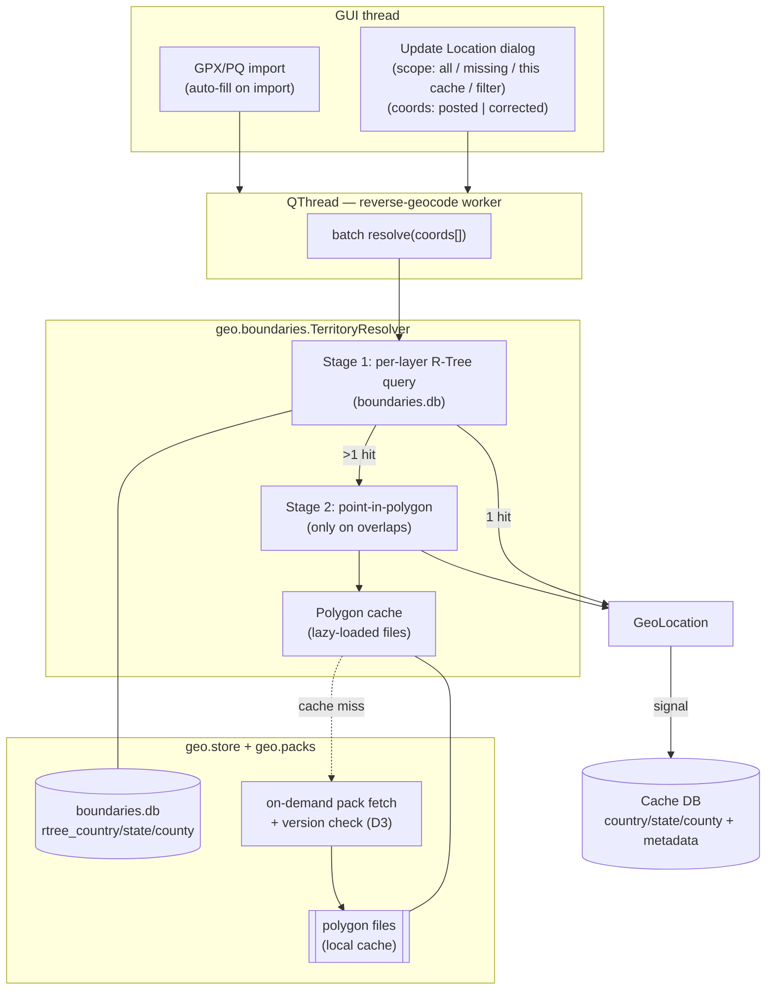
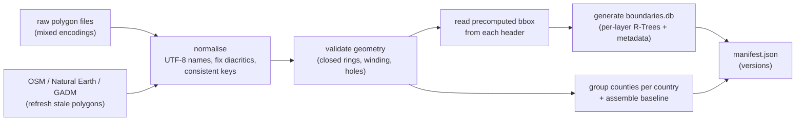

# Architecture — Offline Reverse Geocoding

OpenSAK assigns a **country**, **state/region** and **county** to every cache by
reverse geocoding its coordinates against a polygon-accurate boundary dataset
held on the user's machine. The dataset is **local-first**: boundary data is
fetched once from a remote source and cached on disk, after which lookups need
no network and have no rate limits. A full database resolves on a background
thread in seconds.

This document describes the design of that subsystem — the *boundary engine*.

---

## Contents

- [1. Problem](#1-problem)
- [2. Concept](#2-concept)
- [3. Benefits](#3-benefits)
- [4. Design decisions](#4-design-decisions)
- [5. Boundary data model](#5-boundary-data-model)
  - [5.1 Polygon files](#51-polygon-files)
  - [5.2 The bounding-box database](#52-the-bounding-box-database)
  - [5.3 On-disk layout and caching](#53-on-disk-layout-and-caching)
- [6. System overview](#6-system-overview)
  - [6.1 The two-stage query](#61-the-two-stage-query)
  - [6.2 Build-time data pipeline](#62-build-time-data-pipeline)
  - [6.3 Distribution and updates](#63-distribution-and-updates)
- [7. Database schema](#7-database-schema)
- [8. Dependencies](#8-dependencies)
- [9. Module layout and integration](#9-module-layout-and-integration)
- [10. Performance](#10-performance)
- [11. Accuracy and edge cases](#11-accuracy-and-edge-cases)
- [12. Roadmap](#12-roadmap)
- [13. Risks](#13-risks)
- [Appendix A — Glossary](#appendix-a--glossary)

---

## 1. Problem

Geocachers need reliable **country / state (region) / county** values on every
cache, for three concrete reasons:

1. **County / region challenges.** Many caches qualify a finder for a
   "find a cache in every county"-style challenge. Going to the wrong county is
   expensive — literally, long drives — and frustrating.
2. **Filtering and trip planning.** "Show me caches in this county" only works
   when the field is populated and correct.
3. **Parity with other tools.** Users cross-check OpenSAK against GSAK,
   Project-GC and Cachetur. When the answer disagrees, OpenSAK gets the support
   ticket.

The data is **not** reliably available from the source files:

- Imported GPX / Pocket Query files generally fill `country` and sometimes
  `state`, but **county is almost always empty**.
- A cache's real-world location can differ from its *posted* coordinates —
  multi-caches and mystery/puzzle finals can sit tens of miles away. The
  territory may need computing from **corrected** coordinates.
- Boundaries change over time (county splits, `Turkey → Türkiye`,
  `Czech Republic → Czechia`). Static values go stale.

Reverse geocoding is fundamentally a **point-in-region** query: given a point,
find which administrative polygons contain it. The challenge is doing that
**accurately** (correct at and near borders) and **fast** (tens of thousands of
caches at once), without depending on a live network service per lookup.

---

## 2. Concept

The naive solution — test the point against every polygon — is `O(regions ×
vertices)` per cache and does not scale.

The boundary engine uses a **two-stage lookup** built on a spatial index (see
[SQLite R-Tree](https://sqlite.org/rtree.html)):

1. **Stage 1 — bounding-box filter (R-Tree).** Every region is reduced to its
   min/max latitude and longitude — an axis-aligned bounding box. These boxes
   live in a SQLite **R-Tree** index. Querying it with a point returns only the
   handful of regions whose box *contains* the point. This is `O(log n)` and
   extremely fast.
2. **Stage 2 — point-in-polygon (exact).** In the common case the point lands in
   exactly one box → done, with no geometry maths. Only when boxes **overlap**
   (very common for counties, and near any border) does the engine run the
   precise point-in-polygon test, and only on the 2–3 candidates Stage 1
   returned.

This keeps the expensive geometry off the hot path. Because a county record
names its parent state and country, a single county hit fills all three fields
at once.

The design follows the proven structure GSAK has used for years (its
`bb.db3` + polygon-file system), re-expressed in clean, modern data.

---

## 3. Benefits

- **Local-first and fast.** Once the relevant boundary data is cached on the
  machine, a 10k+ cache database resolves locally in seconds — no per-lookup
  network call, no rate limits, works in the field.
- **Polygon-accurate.** Results are correct at and near borders, not snapped to
  the nearest town. This is what challenge caching requires.
- **Auditable provenance.** Every value records where it came from (imported vs
  computed), which coordinates produced it (posted vs corrected), when, and
  against which boundary dataset version.
- **Both coordinate bases.** Posted coordinates by default (checker
  compatibility); corrected coordinates on demand for physical planning.
- **Controlled footprint.** A small baseline ships with the app; detailed
  county data is fetched and cached only when a region actually needs it.
- **Live-updatable data.** Boundaries refresh independently of app releases via
  per-file version numbers.
- **Tool parity.** Built on the same boundary lineage the wider community
  already uses, so results line up with established tools.
- **Extensible.** The same engine serves any boundary *layer* — custom polygons
  (Delorme, Ordnance Survey, challenge regions) need only data, not code.

---

## 4. Design decisions

| # | Decision | Choice | Rationale |
|---|----------|--------|-----------|
| D1 | **Boundary data source** | Community polygon files of GSAK lineage, **normalised** to UTF-8 with consistent naming, from which OpenSAK regenerates its own R-Tree database. The native text format is kept (no conversion). | Community parity for support; crowd-sourced coverage; fixes the mixed encodings/diacritics (`Türkiye`, broken `©`) in the source files; direct compatibility with the files maintainers already produce. |
| D2 | **Result storage** | `Cache.country/state/county` hold the single result set; **provenance metadata** (source, coordinate basis, timestamp, dataset version) sits alongside. | Re-runnable and auditable without doubling every column. |
| D3 | **Distribution** | Ship a small **baseline** dataset (country + state); fetch **county packs per country, on demand**, and cache them locally with a checkable version number. | Controls install/DB footprint; updates boundaries without an app release; avoids shipping 26k+ county polygons up front. |
| D4 | **Granularity** | A **layered** engine — country/state/county today, extensible to custom layers — each layer being its own R-Tree + metadata table. | One query path for every layer; adding a custom layer is data, not code. |

Recorded alternatives:

- *Wholesale build from Natural Earth / GADM / OSM only* — clean data, but
  county coverage is hard and results diverge from established tools, generating
  support load. These sources are used to **refresh** individual polygons under
  D1, not as the wholesale base.
- *Convert polygons to GeoJSON* — the native text format is simpler (a header
  plus `lat,lon` rows), already carries a precomputed bounding box, and matches
  what upstream maintainers ship and edit. Conversion is left as an optional
  interop step, not a requirement.
- *Separate `corrected_*` columns* — instead, D2's `location_basis` records
  which coordinates produced the stored value.
- *Bundle every polygon* — simplest, but bloats the install; rejected for D3.

---

## 5. Boundary data model

Two artefacts, mirroring the GSAK lineage in cleaned form.

### 5.1 Polygon files

One self-describing text file per region (or per grouped set, for counties).
A header of `#` comment lines carries the display name, the **source and
licence**, and a **precomputed bounding box**; the body is one `lat,lon` pair
per line. A file may hold several polygons (islands); each polygon's first and
last coordinate match (closed ring), and holes (enclaves) are wound in the
opposite direction.

```text
# GsakName=Denmark
# This Country polygon is based on data © OpenStreetMap contributors
# The OpenStreetMap data is made available under the Open Database License (ODbL)
# Bounding Box: 57.9524297,54.4516667,12.9058301,7.7153255
54.8370717,9.4829269
54.8316638,9.4629539
54.8333102,9.4601121
...
```

Key consequences captured by the format:

- The **licence travels with the data.** OSM-derived polygons are **ODbL**
  (attribution + share-alike), *not* public domain; other files may carry other
  terms. The engine preserves the header and surfaces the aggregate attributions
  (see [§13](#13-risks)).
- The bounding box is **already computed**, so building the index ([§5.2](#52-the-bounding-box-database))
  is a trivial read, not a geometry pass.
- Files are **normalised to UTF-8** on ingest (the source files are mixed
  encodings — note the broken `©` above), fixing diacritics and renames.

County granularity is grouped: a country's county polygons live together (e.g.
all of Portugal's ~3,900, all of Brazil's ~5,500) and each county record points
to its polygon **within** that group — which makes "per-country" the natural
download unit ([§5.3](#53-on-disk-layout-and-caching)).

### 5.2 The bounding-box database

A SQLite file (`boundaries.db`) generated **once** from the polygon-file
headers. It is the spatial index plus metadata, and contains **no information
not derivable from the polygons**, so it inherits their terms.

GSAK's shipped `bb.db3` uses **one R-Tree per layer** with a companion metadata
table, joined by id — for example:

```sql
-- one spatial index per layer (country / state / county)
CREATE VIRTUAL TABLE rtree_county USING rtree(bbid, MinLat, MaxLat, MinLon, MaxLon);

-- companion metadata; bbid == rowid of this table
CREATE TABLE bb_county (Country, State, File, MaxLat, MinLat, MaxLon, MinLon, Cname);
```

OpenSAK keeps that proven shape, cleaned and consistently named:

```sql
-- Stage 1: one R-Tree per layer (SQLite built-in module)
CREATE VIRTUAL TABLE rtree_country USING rtree(id, min_lat, max_lat, min_lon, max_lon);
CREATE VIRTUAL TABLE rtree_state   USING rtree(id, min_lat, max_lat, min_lon, max_lon);
CREATE VIRTUAL TABLE rtree_county  USING rtree(id, min_lat, max_lat, min_lon, max_lon);

-- Stage 2 / metadata: one row per region, id == matching R-Tree id
CREATE TABLE region_county (
    id            INTEGER PRIMARY KEY,
    name          TEXT NOT NULL,   -- UTF-8, normalised ('Türkiye')
    parent        TEXT,            -- 'US/TX' — links county -> state -> country
    polygon_file  TEXT NOT NULL,   -- file (and index within it, for grouped counties)
    poly_version  INTEGER NOT NULL,
    is_bundled    INTEGER NOT NULL -- 1 = baseline install, 0 = on-demand pack
);
-- region_country / region_state follow the same shape.

-- Per-file versions, driving update checks (mirrors GSAK's Version table)
CREATE TABLE file_version (layer TEXT, country TEXT, state TEXT, version INTEGER);
```

A US-county name/abbreviation reference table is carried alongside (GSAK ships
one) to normalise names — e.g. stripping the spurious word "County" some sources
append.

> **Why SQLite's own R-Tree** rather than an external index package: it is a
> compile-time-standard SQLite module (no extra native dependency to ship on
> Windows/macOS/Linux), it persists to disk for free, and it keeps the index
> next to the metadata. Point-in-polygon (Stage 2) is the only piece needing a
> geometry library — see [§8](#8-dependencies).

For scale: a real `bb.db3` holds ~384 countries, ~2,330 state polygons and
~26,170 county polygons in roughly 7 MB — bounding boxes only. The polygon files
themselves are far larger and are why counties are fetched on demand.

### 5.3 On-disk layout and caching

Under the platform app-data directory (resolved by `config.get_app_data_dir()`):

```
<app-data>/opensak/
├── Default.db                 # the cache database
└── boundaries/
    ├── boundaries.db          # generated R-Trees + metadata (baseline)
    ├── manifest.json          # dataset version + per-pack versions
    ├── countries/             # baseline — bundled with the install
    │   └── *.txt
    ├── states/                # baseline — bundled with the install
    │   └── *.txt
    └── counties/              # fetched per country on demand, then cached
        ├── prt.txt
        └── usa-tx.txt
```

The `counties/` directory **is the cache**: a county pack is downloaded once,
written here, and every later lookup reads it locally. Nothing is re-fetched
unless a version bump says the data changed ([§6.3](#63-distribution-and-updates)).

---

## 6. System overview



### 6.1 The two-stage query

```
            point (lat, lon)
                  │
                  ▼
   ┌──────────────────────────────┐
   │ Stage 1  R-Tree bbox SELECT   │   ~O(log n), microseconds
   │ WHERE min_lat<=? AND max_lat  │
   │   >=? AND min_lon<=? ...       │
   └──────────────┬────────────────┘
                  │ candidate region ids
        ┌─────────┴──────────┐
        │                    │
   exactly 1 hit        2+ hits (overlap / border)
        │                    │
        ▼                    ▼
     DONE          ┌────────────────────────┐
   (no geometry)   │ Stage 2  point-in-poly  │  only on 2–3 candidates
                   │ load polygon, ray-cast  │
                   │ (holes respected)       │
                   └───────────┬─────────────┘
                               ▼
                        winning region
```

The lookup runs per layer; a county hit also yields its state and country
through the record's `parent`, so one query can fill all three fields.

### 6.2 Build-time data pipeline

A maintainer-run pipeline lives under `tools/` (kept out of the runtime package
and excluded from release bundles). It turns raw polygon files into shippable
artefacts:



Building `boundaries.db` is mostly reading the `# Bounding Box` line already
present in each file — a quick, one-off process repeated whenever the dataset
changes.

### 6.3 Distribution and updates

- **Baseline** (`countries/`, `states/`, `boundaries.db`) ships as package data
  in the install, so country/state resolution works with no network from first
  launch.
- **County packs** are fetched per country the first time a lookup needs one:
  when a county box is hit but its polygon file is not yet in the local cache,
  `geo.packs` downloads that country's pack from a versioned host (release
  assets / `opensak.com`), writes it under `counties/`, and serves it locally
  thereafter.
- **Versions.** `boundaries.db` carries per-file versions; `manifest.json`
  carries a dataset version. On launch (or on user request) OpenSAK compares
  against the remote manifest and offers to refresh changed packs — so boundary
  data, including `boundaries.db` itself, updates independently of app releases.

So the **only** time the network is involved is the first fetch of a region's
data (or a deliberate refresh); steady-state operation is fully local.

---

## 7. Database schema

The `Cache` model carries the three result fields plus provenance metadata:

```python
# Territory result (one set per cache)
country: Mapped[Optional[str]] = mapped_column(String(64))
state:   Mapped[Optional[str]] = mapped_column(String(64))
county:  Mapped[Optional[str]] = mapped_column(String(64))

# Provenance (D2)
location_source:  Mapped[Optional[str]] = mapped_column(String(16))   # 'groundspeak' | 'computed'
location_basis:   Mapped[Optional[str]] = mapped_column(String(16))   # 'posted' | 'corrected'
location_updated: Mapped[Optional[datetime]] = mapped_column(DateTime)
location_dataset: Mapped[Optional[str]] = mapped_column(String(32))   # boundary dataset version used
```

Corrected coordinates are read from the one-to-one `UserNote`
(`corrected_lat`, `corrected_lon`, `is_corrected`).

Schema changes are versioned through `PRAGMA user_version` (see
`db/database.py`): the engine bumps `SCHEMA_VERSION` and adds the provenance
columns idempotently, so existing databases upgrade in place with the metadata
defaulting to "unknown / imported".

The provenance fields let a user tell, per cache, whether a value came from the
import source, from posted coordinates, or from corrected coordinates — and
whether it predates a boundary refresh.

---

## 8. Dependencies

| Need | Choice | Notes |
|------|--------|-------|
| R-Tree (Stage 1) | **SQLite built-in `rtree`** | No new dependency; standard in CPython's bundled SQLite. |
| Point-in-polygon (Stage 2) | **`shapely`** | C-backed (GEOS), correct with holes/multipolygons, cross-platform wheels. A pure-Python ray-casting fallback stays available for a zero-native-dependency build, at some speed/robustness cost. |
| Polygon parsing | stdlib | Plain `lat,lon` text; no GIS reader needed. |
| Country code → name | `pycountry` | Normalising ISO codes to display names in the pipeline. |

---

## 9. Module layout and integration

The engine is a self-contained `geo` subpackage; the build pipeline is separate
and not packaged.

```
src/opensak/geo/
├── __init__.py
├── boundaries.py     # TerritoryResolver: two-stage lookup, returns GeoLocation
├── store.py          # open boundaries.db, resolve polygon paths, lazy polygon cache
└── packs.py          # on-demand county-pack fetch + manifest/version check

tools/boundaries/     # build-time only, excluded from packaging
├── normalise.py      # raw polygons -> clean UTF-8
├── build_bbdb.py     # polygon headers -> boundaries.db (R-Trees + metadata)
└── pack.py           # group counties, assemble baseline, emit manifest.json
```

`TerritoryResolver` returns a `GeoLocation(country, state, county)` value.

### GUI integration

The feature follows the project's UI conventions:

- An **Update Location** dialog drives it, reachable from the Waypoint menu and
  from the cache-table right-click menu. It offers scope (all caches / only
  missing / this cache / current filter) and a coordinate-basis choice (posted
  vs corrected, **defaulting to posted** for checker compatibility).
- Resolution runs in a **`QThread`** worker that streams progress and results
  back via Qt signals — the main thread never blocks (a 10k+ batch is heavy).
- The same worker runs automatically after a GPX/PQ import to fill missing
  territory data.
- All user-visible strings go through `tr()` with keys present in every
  `lang/*.py` module.

---

## 10. Performance

| Stage | Cost | Notes |
|-------|------|-------|
| Stage 1 (R-Tree) | ~`O(log n)` per point | Batched; tens of thousands of points in well under a second. |
| Stage 2 (polygon) | only on bbox overlaps | Typically 2–3 candidate polygons; skipped entirely for interior points. |
| Polygon I/O | lazy + cached | Each region's file loads once and is reused across the batch — a Pocket Query clusters geographically, so cache hit rates are high. |

The work stays on the `QThread` with progress signals; a 10k+ batch completes in
seconds once the relevant packs are cached.

---

## 11. Accuracy and edge cases

- **Borders.** Stage 2 resolves overlapping boxes exactly. The residual risk is
  an *approximate polygon* itself — mitigated by D1's refresh pipeline and the
  user-override path on the roadmap.
- **Pack not yet cached.** Box hit but the county pack is absent locally → fetch
  and cache on demand (D3); if no network is available, return the coarser layer
  already cached (e.g. state without county) and flag it, never a wrong guess.
- **No box hit.** A point over open water or an unmapped area leaves the field
  empty rather than snapping to the nearest land.
- **Diacritics / renames.** Fixed at normalisation time (D1): UTF-8, `Türkiye`,
  `Czechia`, etc. `location_dataset` records the dataset version used, so
  renames stay explainable after the fact.
- **Posted vs corrected.** `location_basis` records the choice per cache;
  re-running with the other basis updates both the value and the metadata.

---

## 12. Roadmap

- **Locking and overrides.** A locked field is never overwritten by re-runs or
  import. Builds on the planned custom-fields system.
- **Macro hook.** A macro can recompute territories and stash the previous value
  in a custom field, respecting locks.
- **Custom layers.** D4's layered engine already accepts new layers — Delorme,
  Ordnance Survey, challenge regions — by adding an `rtree_<layer>` + metadata
  table and the polygon packs.

---

## 13. Risks

| Risk | Mitigation |
|------|------------|
| `shapely`/GEOS native wheels across OSes | Verified in the CI matrix (3.11/3.12, Linux/macOS/Windows); pure-Python ray-cast fallback available. |
| County polygon footprint | D3 per-country packs, fetched and cached on demand; ship only baseline. |
| Stale / approximate polygons | D1 refresh pipeline + `location_dataset` provenance + future overrides. |
| Disagreement with other tools | Expected when a tool applies different boundaries or a different coordinate basis. The posted/corrected toggle and `location_basis` make disagreements explainable, not silent. |
| Boundary-data licensing | The licence travels in each polygon header — OSM-derived data is **ODbL** (attribution + share-alike), not public domain. The engine preserves headers and ships the aggregate attributions; `boundaries.db` is a derived index (bounding boxes only) under the same terms. |

---

## Appendix A — Glossary

- **Reverse geocoding** — turning `(lat, lon)` into place names.
- **Point-in-polygon** — geometric test of whether a point lies inside a polygon
  (ray casting / winding number).
- **R-Tree** — a tree index for rectangles; answers "which boxes contain or
  overlap this point/box?" quickly. SQLite ships one.
- **Bounding box** — the smallest axis-aligned rectangle enclosing a region; the
  Stage-1 approximation, precomputed in each polygon file's header.
- **Posted vs corrected coordinates** — published listing coordinates vs the
  user's solved/real coordinates (stored on `UserNote`).
- **Layer** — a category of boundary (country / state / county / custom), each
  its own R-Tree + metadata table.
- **Local-first** — data is fetched from a remote source once, cached on disk,
  and served locally thereafter; the network is touched only on first fetch or a
  deliberate refresh.
